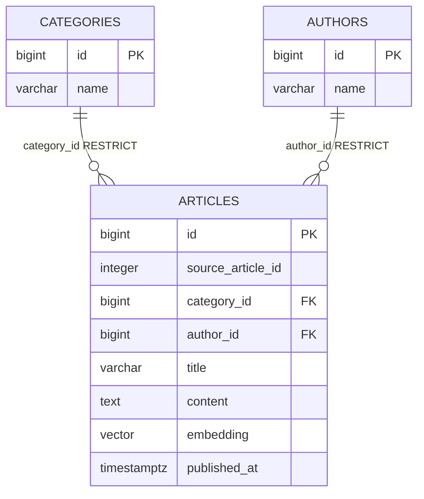

# データベース設計書

## 1. 設計方針

### 1.1 命名規則

- テーブル名、カラム名、インデックス名は snake_case とする。
- テーブル名は複数形とする。
- 主キーは原則 `id` とし、型は `BIGSERIAL` とする。
- 外部キーは `{参照先単数形}_id` とする。
- インデックス名は `idx_{table}_{columns}`、一意制約は `uq_{table}_{columns}` とする。

### 1.2 共通カラム

- 日時型は `TIMESTAMPTZ` を使用する。
- 選択肢項目は `VARCHAR` ではなく追加テーブルで表現する。
- NULL 許可かつ DB デフォルト未設定の項目は、本設計書の「デフォルト」列では `-` と記載する。

### 1.3 インデックス方針

- 記事一覧は `articles.published_at` を利用して降順ページングする。
- キーワード検索は PostgreSQL Full Text Search を主軸とし、`pg_trgm` による類似度を補助的に利用する。
- 記事検索は `articles.title`、`articles.content`、embedding vector index を利用する。
- CSV 再投入時の重複防止は `articles.source_article_id` の一意制約で担保する。
- ベクトル検索は pgvector の `vector(384)` と HNSW index を前提とする。
- `title`、`content`、`title + author_id` は `docs/articles.csv` 内で重複するため UNIQUE 制約を設定しない。

### 1.4 物理削除方針

- 削除フラグや削除日時カラムは持たせず、すべて物理削除で扱う。
- DB の外部キーでは自動連鎖削除を使用しない。
- 外部キーの親削除時動作は `RESTRICT` とする。
- 記事削除時は `articles` を物理削除する。
- カテゴリまたは著者に紐づく記事が存在する場合、そのカテゴリまたは著者は削除できない。

### 1.5 マスタテーブル方針

`docs/articles.csv` の `category` は単一選択項目として `categories` テーブルで管理する。`author` は表記ゆれを防ぎ、記事との関係を明確にするため `authors` テーブルで管理する。

### 1.6 CSV マッピング

初期投入では `docs/articles.csv` を読み込む。CSV は 1,000 件のデータを持ち、ヘッダーは `id,title,content,author,category,published_at` である。

| CSVカラム | 取込先 | 備考 |
|---|---|---|
| id | articles.source_article_id | CSV 内の外部入力 ID。DB 主キーとは分離し、CSV 再投入時の冪等性担保に利用する |
| title | articles.title | 記事タイトル |
| content | articles.content | 記事本文 |
| author | authors.name | 存在しない場合は `authors` に追加して `articles.author_id` で参照する |
| category | categories.name | 存在しない場合は `categories` に追加して `articles.category_id` で参照する |
| published_at | articles.published_at | 記事公開日時 |

`category` の変換規則は以下とする。

| CSV値 | categories.name |
|---|---|
| Backend | Backend |
| Frontend | Frontend |
| DevOps | DevOps |
| AI/ML | AI/ML |

## 2. ER図

## 3. テーブル定義

### 3.1 categories

記事カテゴリのマスタを管理する。

| カラム名 | 型 | NULL | PK | FK | デフォルト | 説明 |
|---|---|---|---|---|---|---|
| id | BIGSERIAL | NO | YES | - | nextval | カテゴリID |
| name | VARCHAR(64) | NO | NO | - | - | システム内部で扱うカテゴリ名 |

#### インデックス

| インデックス名 | カラム | 種別 | 目的 |
|---|---|---|---|
| uq_categories_name | name | UNIQUE | カテゴリ名の重複防止 |

### 3.2 authors

著者のマスタを管理する。

| カラム名 | 型 | NULL | PK | FK | デフォルト | 説明 |
|---|---|---|---|---|---|---|
| id | BIGSERIAL | NO | YES | - | nextval | 著者ID |
| name | VARCHAR(255) | NO | NO | - | - | 著者名 |

#### インデックス

| インデックス名 | カラム | 種別 | 目的 |
|---|---|---|---|
| uq_authors_name | name | UNIQUE | 著者名の重複防止 |

### 3.3 articles

記事本体を管理する。記事単位の embedding を保持し、MVP のセマンティック検索対象とする。

| カラム名 | 型 | NULL | PK | FK | デフォルト | 説明 |
|---|---|---|---|---|---|---|
| id | BIGSERIAL | NO | YES | - | nextval | 記事ID |
| source_article_id | INTEGER | YES | NO | - | - | `docs/articles.csv` の `id`。CSV 内の外部入力 IDであり、CSV 再投入時の冪等性担保に利用する |
| category_id | BIGINT | NO | NO | categories.id (ON DELETE RESTRICT) | - | 記事カテゴリID |
| author_id | BIGINT | NO | NO | authors.id (ON DELETE RESTRICT) | - | 著者ID |
| title | VARCHAR(255) | NO | NO | - | - | 記事タイトル |
| content | TEXT | NO | NO | - | - | 記事本文 |
| embedding | vector(384) | YES | NO | - | - | 記事単位の embedding |
| published_at | TIMESTAMPTZ | NO | NO | - | - | `docs/articles.csv` の `published_at` |

#### インデックス

| インデックス名 | カラム | 種別 | 目的 |
|---|---|---|---|
| uq_articles_source_article_id | source_article_id | UNIQUE | CSV 再投入時の冪等性担保と外部 ID 重複防止 |
| idx_articles_published_at | published_at | BTREE | 記事公開日の降順表示 |
| idx_articles_category_published_at | category_id, published_at | BTREE | カテゴリ別の記事抽出 |
| idx_articles_author_published_at | author_id, published_at | BTREE | 著者別の記事抽出 |
| idx_articles_title | title | BTREE | タイトル検索補助 |
| idx_articles_full_text | title, content | GIN (expression) | `to_tsvector('simple', title || ' ' || content)` によるキーワード検索 |
| idx_articles_title_trgm | title | GIN (gin_trgm_ops) | タイトルの部分一致・表記ゆれ補助 |
| idx_articles_content_trgm | content | GIN (gin_trgm_ops) | 本文の部分一致・表記ゆれ補助 |
| idx_articles_embedding_hnsw | embedding vector_cosine_ops | HNSW | 記事単位のセマンティック検索 |

## 4. リレーション定義

| 親テーブル | 子テーブル | 関係 | FK | 説明 |
|---|---|---|---|---|
| categories | articles | 1 対 多 | articles.category_id -> categories.id (ON DELETE RESTRICT) | 記事カテゴリを管理する |
| authors | articles | 1 対 多 | articles.author_id -> authors.id (ON DELETE RESTRICT) | 記事著者を管理する |

## 5. マイグレーション計画

| # | 内容 | 依存 | 備考 |
|---|---|---|---|
| 1 | pgvector 拡張を有効化する | PostgreSQL 起動 | `CREATE EXTENSION IF NOT EXISTS vector;` |
| 2 | pg_trgm 拡張を有効化する | PostgreSQL 起動 | `CREATE EXTENSION IF NOT EXISTS pg_trgm;` |
| 3 | `categories` を作成する | 1, 2 | カテゴリマスタを保持 |
| 4 | `authors` を作成する | 1, 2 | 著者マスタを保持 |
| 5 | `articles` を作成する | 3, 4 | 記事本体と記事単位 embedding を保持 |
| 6 | 各種 index と unique 制約を作成する | 3-5 | 一覧、検索、重複防止、関連取得に利用 |
| 7 | `docs/articles.csv` の初期投入スクリプトを実行する | 1-6 | CSV の `content` を `articles.content` に取り込み、`source_article_id` で重複投入を防止 |
