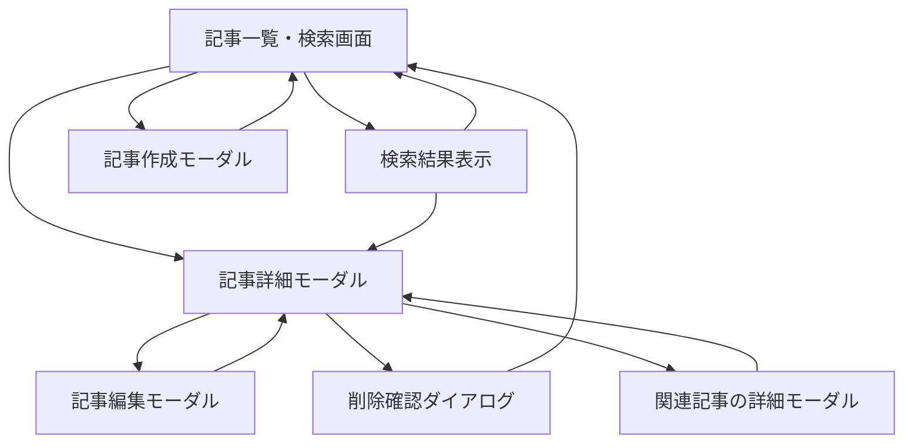

# 画面設計書

## 1. 画面一覧

| # | 画面名 | URL | 認証 | ロール | 説明 |
|---|---|---|---|---|---|
| 1 | 記事一覧・検索画面 | `/articles` | 不要 | ナレッジベース利用者/管理者 | 記事一覧、検索、検索モード切り替え、作成導線を提供する |
| 2 | 記事詳細モーダル | `/articles?articleId={id}` | 不要 | ナレッジベース利用者/管理者 | 記事本文、メタデータ、関連記事、編集/削除導線を表示する |
| 3 | 記事作成モーダル | `/articles?modal=create` | 不要 | ナレッジベース管理者 | 新しい記事を作成する |
| 4 | 記事編集モーダル | `/articles?articleId={id}&modal=edit` | 不要 | ナレッジベース管理者 | 既存記事を編集する |
| 5 | 削除確認ダイアログ | `/articles?articleId={id}&modal=delete` | 不要 | ナレッジベース管理者 | 記事削除前に確認する |

## 2. 画面遷移図



## 3. 画面詳細

### 3.1 記事一覧・検索画面

#### 概要

`DB設計 デザイン 記事一覧.html` の「01 記事一覧」「02 キーワード検索」「03 セマンティック検索」「04 検索結果なし」を統合したメイン画面。初期表示では公開日時の降順で記事カードを表示し、検索語と検索モードに応じて結果表示へ切り替える。
テンプレート由来のダッシュボード画面およびサイドバーは設けず、画面上部のタイトルとして `TechInsights` を表示する。

#### ワイヤーフレーム

```text
+--------------------------------------------------+
| TechInsights                          [新規作成] |
+--------------------------------------------------+
| [検索入力: PostgreSQL                           ] |
| [キーワード] [セマンティック] [ハイブリッド]      |
+--------------------------------------------------+
| [カテゴリ] [タイトル] [公開日]                   |
| [本文スニペット]                                 |
| [著者]                         [類似度スコア]    |
+--------------------------------------------------+
| < 前へ                         1 / n        次へ > |
+--------------------------------------------------+
```

#### 表示項目

| # | 項目名 | 型 | 必須 | 説明 |
|---|---|---|---|---|
| 1 | 画面タイトル | テキスト | YES | `TechInsights` を表示する |
| 2 | 新規作成ボタン | ボタン | YES | 記事作成モーダルを開く |
| 3 | 検索入力 | テキスト入力 | NO | キーワードまたは自然言語クエリを入力する |
| 4 | 検索モード | セグメント | YES | `keyword`、`semantic`、`hybrid` を切り替える |
| 5 | 記事カード | カード | YES | 記事一覧または検索結果を表示する |
| 6 | カテゴリ | バッジ | YES | `Backend`、`Frontend`、`DevOps`、`AI/ML` などを表示する |
| 7 | タイトル | テキスト | YES | 記事タイトルを表示する |
| 8 | 本文抜粋 | テキスト | YES | `content` の先頭または検索該当箇所を表示する |
| 9 | 著者 | テキスト | YES | 著者名とイニシャルを表示する |
| 10 | 公開日時 | 日時 | YES | `published_at` を `YYYY/MM/DD` 形式で表示する |
| 11 | 類似度スコア | 数値バッジ | NO | semantic/hybrid 検索時のみ表示する |
| 12 | ページネーション | ナビゲーション | YES | ページ移動を提供する |
| 13 | 空状態 | 表示状態 | NO | 検索結果が0件の場合に表示する |

#### アクション

| # | アクション | トリガー | 処理内容 | API |
|---|---|---|---|---|
| 1 | 初期一覧取得 | 画面表示 | 公開日時降順の記事一覧を取得する | `GET /api/articles?page=1&limit=12&sort=publishedAt&order=desc` |
| 2 | 検索 | 検索入力の送信 | `q` と `searchMode` を指定して記事一覧を再取得する | `GET /api/articles?q={query}&searchMode={mode}` |
| 3 | 検索モード切替 | セグメント選択 | 同じ検索語で検索方式を切り替える | `GET /api/articles?q={query}&searchMode=keyword|semantic|hybrid` |
| 4 | 検索条件クリア | クリアボタン押下 | 検索語と絞り込みを削除し、初期一覧へ戻す | `GET /api/articles?page=1&limit=12` |
| 5 | ページ移動 | 前へ/次へ押下 | 指定ページの記事一覧を取得する | `GET /api/articles?page={page}&limit=12` |
| 6 | 詳細表示 | 記事カード押下 | 記事詳細モーダルを開く | `GET /api/articles/{articleId}` |
| 7 | 新規作成 | 新規作成ボタン押下 | 記事作成モーダルを開く | `GET /api/categories`, `GET /api/authors` |

#### バリデーション

- `page` は 1 以上の整数とする。
- `limit` は 1 以上 100 以下の整数とする。
- `searchMode` は `keyword`、`semantic`、`hybrid` のいずれかとする。
- `q` が空の場合は通常一覧として扱う。

#### エラー表示

- API失敗時は画面上部または記事一覧領域にエラーを表示する。
- 検索結果が0件の場合は、虫眼鏡アイコン、説明文、検索条件クリアボタンを表示する。
- semantic/hybrid 検索でモデルロードに失敗した場合は、検索モードを切り替える案内を表示する。

#### レスポンシブ対応

- デスクトップはサイドバーなしでコンテンツ幅を制御し、記事カードを3列で表示する。
- タブレットは記事カードを2列で表示する。
- モバイルは記事カードを1列で表示する。
- 検索モードは横並びを維持し、幅が足りない場合は横スクロールにする。

### 3.2 記事詳細モーダル

#### 概要

記事カード選択後に表示するモーダル。記事本文、カテゴリ、著者、公開日時、`source_article_id`、関連記事、編集/削除導線を表示する。

#### ワイヤーフレーム

```text
+----------------------------------------------+
| タイトル                                [x]  |
| [カテゴリ] [著者] [公開日] [source_article_id] |
+----------------------------------------------+
| content                                      |
|                                              |
+----------------------------------------------+
| 関連記事                                     |
| [関連記事カード] [関連記事カード] [関連記事カード] |
+----------------------------------------------+
|                                  [編集] [削除] |
+----------------------------------------------+
```

#### 表示項目

| # | 項目名 | 型 | 必須 | 説明 |
|---|---|---|---|---|
| 1 | タイトル | テキスト | YES | 記事タイトル |
| 2 | カテゴリ | バッジ | YES | 記事カテゴリ |
| 3 | 著者 | テキスト | YES | 著者名 |
| 4 | 公開日時 | 日時 | YES | 公開日 |
| 5 | source_article_id | 数値 | NO | CSV由来記事の場合に表示する |
| 6 | 本文 | テキスト | YES | `content` の全文 |
| 7 | 関連記事 | カードリスト | NO | 類似記事を最大3件表示する |
| 8 | 編集ボタン | ボタン | YES | 編集モーダルを開く |
| 9 | 削除ボタン | ボタン | YES | 削除確認ダイアログを開く |

#### アクション

| # | アクション | トリガー | 処理内容 | API |
|---|---|---|---|---|
| 1 | 詳細取得 | モーダル表示 | 指定記事の全文とメタデータを取得する | `GET /api/articles/{articleId}` |
| 2 | 関連記事取得 | 詳細取得後 | 関連記事を取得する | `GET /api/articles/{articleId}/related-articles?limit=3` |
| 3 | 編集 | 編集ボタン押下 | 記事編集モーダルを開く | `GET /api/categories`, `GET /api/authors` |
| 4 | 削除 | 削除ボタン押下 | 削除確認ダイアログを開く | - |
| 5 | 閉じる | 閉じるボタン/背景押下 | モーダルを閉じて一覧へ戻る | - |

#### バリデーション

- `articleId` は 1 以上の整数とする。
- 記事が存在しない場合は 404 として扱う。

#### エラー表示

- 詳細取得失敗時はモーダル内にエラーを表示する。
- 関連記事取得のみ失敗した場合、本文表示は維持し、関連記事領域だけエラーまたは空状態にする。

#### レスポンシブ対応

- デスクトップは幅 640px 程度のモーダルで表示する。
- モバイルは画面幅に合わせ、本文を縦スクロール可能にする。
- 関連記事はデスクトップで3列、モバイルで1列にする。

### 3.3 記事作成モーダル

#### 概要

新しい記事を作成するモーダル。作成成功後、一覧と検索対象へ反映する。画面作成記事はCSV由来ではないため、`source_article_id` は入力しない。

#### ワイヤーフレーム

```text
+-----------------------------+
| 記事作成                [x] |
+-----------------------------+
| タイトル                    |
| 本文                        |
| 著者                        |
| カテゴリ                    |
| 公開日時                    |
+-----------------------------+
|                  [キャンセル] [保存] |
+-----------------------------+
```

#### 表示項目

| # | 項目名 | 型 | 必須 | 説明 |
|---|---|---|---|---|
| 1 | タイトル | テキスト入力 | YES | 記事タイトル |
| 2 | 本文 | テキストエリア | YES | 記事本文 `content` |
| 3 | 著者 | セレクト/入力 | YES | 既存著者を選ぶか新規名を入力する |
| 4 | カテゴリ | セレクト | YES | `categories` から選択する |
| 5 | 公開日時 | 日時入力 | YES | 記事の公開日時 |
| 6 | 保存ボタン | ボタン | YES | 作成APIを実行する |
| 7 | キャンセルボタン | ボタン | YES | 入力内容を破棄して閉じる |

#### アクション

| # | アクション | トリガー | 処理内容 | API |
|---|---|---|---|---|
| 1 | 選択肢取得 | モーダル表示 | カテゴリと著者候補を取得する | `GET /api/categories`, `GET /api/authors` |
| 2 | 記事作成 | 保存ボタン押下 | 入力値を保存し、embedding を生成する | `POST /api/articles` |
| 3 | キャンセル | キャンセル押下 | モーダルを閉じる | - |

#### バリデーション

- タイトル、本文、著者、カテゴリ、公開日時は必須。
- タイトルは 255 文字以内。
- 公開日時は日時として解釈できる値にする。

#### エラー表示

- 必須項目未入力は項目単位で表示する。
- APIの 422 はフォーム項目に紐づけて表示する。
- 保存失敗時はモーダル上部にエラーを表示する。

#### レスポンシブ対応

- デスクトップはモーダル表示。
- モバイルは画面下からのシートまたは全画面モーダルとして表示する。

### 3.4 記事編集モーダル

#### 概要

既存記事を編集するモーダル。タイトルまたは本文が変わった場合は embedding 再生成対象とする。

#### ワイヤーフレーム

```text
+-----------------------------+
| 記事編集                [x] |
+-----------------------------+
| タイトル                    |
| 本文                        |
| 著者                        |
| カテゴリ                    |
| 公開日時                    |
+-----------------------------+
|                  [キャンセル] [更新] |
+-----------------------------+
```

#### 表示項目

| # | 項目名 | 型 | 必須 | 説明 |
|---|---|---|---|---|
| 1 | タイトル | テキスト入力 | YES | 現在の記事タイトルを初期値にする |
| 2 | 本文 | テキストエリア | YES | 現在の `content` を初期値にする |
| 3 | 著者 | セレクト/入力 | YES | 現在の著者を初期値にする |
| 4 | カテゴリ | セレクト | YES | 現在のカテゴリを初期値にする |
| 5 | 公開日時 | 日時入力 | YES | 現在の公開日時を初期値にする |
| 6 | 更新ボタン | ボタン | YES | 更新APIを実行する |

#### アクション

| # | アクション | トリガー | 処理内容 | API |
|---|---|---|---|---|
| 1 | 編集初期値取得 | モーダル表示 | 記事詳細と選択肢を取得する | `GET /api/articles/{articleId}`, `GET /api/categories`, `GET /api/authors` |
| 2 | 記事更新 | 更新ボタン押下 | 入力値で記事を更新する | `PUT /api/articles/{articleId}` |
| 3 | キャンセル | キャンセル押下 | 変更を破棄して閉じる | - |

#### バリデーション

- 記事作成モーダルと同じ。
- 対象記事が存在しない場合は 404 とする。

#### エラー表示

- 入力不備は項目単位で表示する。
- 対象記事が削除済みまたは存在しない場合は、一覧へ戻す導線を表示する。

#### レスポンシブ対応

- 記事作成モーダルと同じ。

### 3.5 削除確認ダイアログ

#### 概要

記事削除前に破壊的操作であることを確認する。削除は物理削除で行う。

#### ワイヤーフレーム

```text
+-----------------------------+
| 記事を削除しますか？        |
| 削除後は一覧・検索結果から消えます。 |
+-----------------------------+
|                  [キャンセル] [削除] |
+-----------------------------+
```

#### 表示項目

| # | 項目名 | 型 | 必須 | 説明 |
|---|---|---|---|---|
| 1 | 確認メッセージ | テキスト | YES | 削除の影響を説明する |
| 2 | 記事タイトル | テキスト | YES | 削除対象を明示する |
| 3 | 削除ボタン | ボタン | YES | 削除APIを実行する |
| 4 | キャンセルボタン | ボタン | YES | 削除せずに閉じる |

#### アクション

| # | アクション | トリガー | 処理内容 | API |
|---|---|---|---|---|
| 1 | 削除実行 | 削除ボタン押下 | 対象記事を物理削除する | `DELETE /api/articles/{articleId}` |
| 2 | キャンセル | キャンセル押下 | ダイアログを閉じる | - |

#### バリデーション

- `articleId` は必須。

#### エラー表示

- 削除対象が存在しない場合は 404 を表示し、一覧を再読み込みする。
- 削除失敗時はダイアログ内にエラーを表示する。

#### レスポンシブ対応

- モバイルでは画面幅に合わせた確認ダイアログにする。

## 4. 共通コンポーネント

| コンポーネント | 使用画面 | 説明 |
|---|---|---|
| 検索入力 | 記事一覧・検索画面 | 検索語または自然言語クエリを入力する |
| 検索モードセグメント | 記事一覧・検索画面 | keyword/semantic/hybrid を切り替える |
| 記事カード | 記事一覧・検索画面、関連記事 | カテゴリ、タイトル、スニペット、著者、公開日時、スコアを表示する |
| カテゴリバッジ | 記事一覧・検索画面、詳細、関連記事 | カテゴリごとの色を表示する |
| 類似度スコアバッジ | 検索結果、関連記事 | semantic/hybrid 検索の類似度を表示する |
| 空状態 | 記事一覧・検索画面 | 0件時に理由と検索条件クリア導線を表示する |
| 記事フォーム | 記事作成モーダル、記事編集モーダル | 作成・編集入力を共通化する |
| 削除確認ダイアログ | 削除確認ダイアログ | 破壊的操作の確認を行う |
